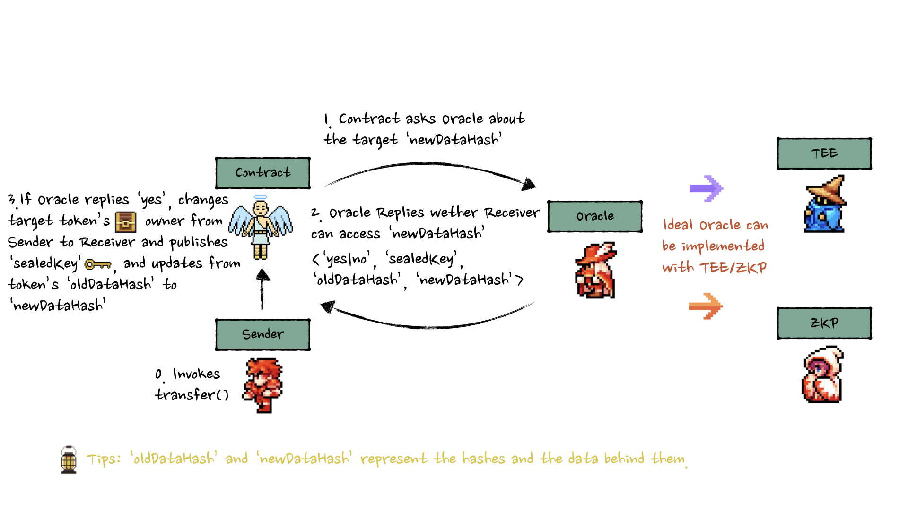
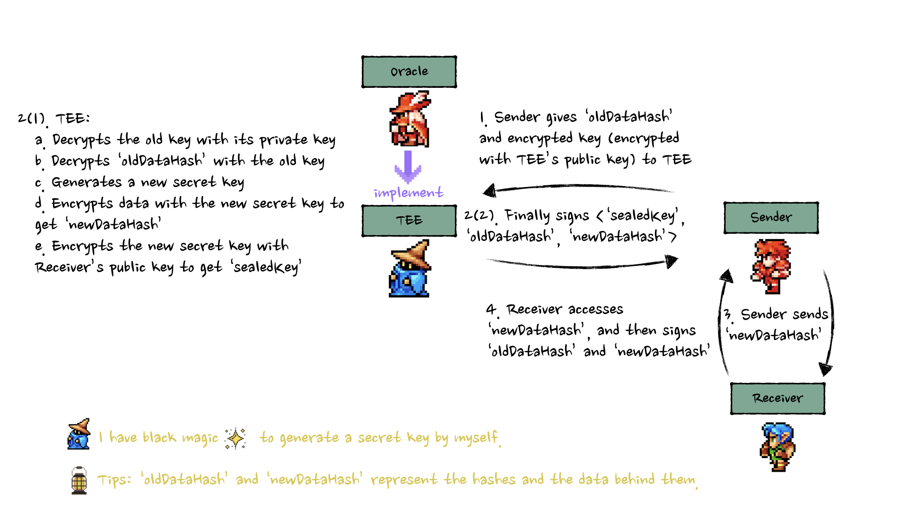
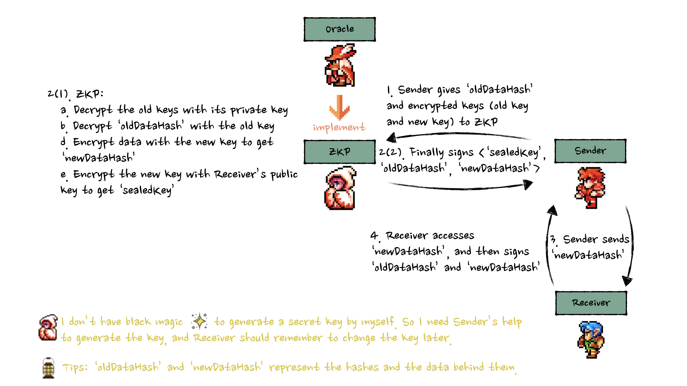
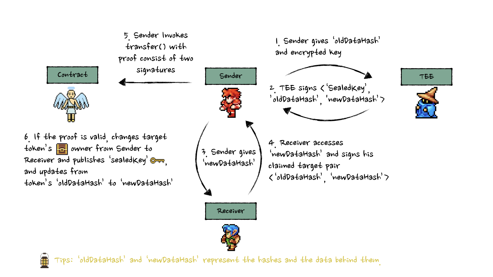

# Agent NFT
## Introduction
With the increasing intelligence of AI models, agents have become increasingly powerful in helping people process meaningful daily tasks automatically. In the blockchain industry, many projects have provided functionality for users to create agents. This trend will continue, and "agent x crypto" has been recognized as one of the biggest narratives in the coming years. Currently, a key missing element is the decentralized management of agent ownership. Specifically, when you create an agent on platforms like Virtuals or EternalAI, there is no on-chain information to verify that the agent you created belongs to you. We believe NFTs could provide a key solution to this problem.

However, there are challenges in simply using existing NFT standards like ERC721 to represent agents. One major reason is that when transferring an agent NFT token, we are not only transferring the tokenId ownership but also the ownership of the metadata. The metadata of an agent is so valuable (it could be the primary purpose of the transfer) that it is often stored in a private environment or in a public environment with encryption. Therefore, the actual transfer of agent metadata needs to be done in a privacy-preserving and verifiable manner. ERC721 lacks the capability to fulfill this type of transfer.

## Our Scheme

We therefore propose a new NFT standard, ERC7857, to address this problem. To better understand how this new protocol works, let's first examine how the metadata can be transferred privately and verified in the ERC7857 smart contract. The transfer() interface accepts a proof parameter which verifies the following conditions. For better understanding, we abstract the process of proof generation and verification as an interaction with an ideal oracle that always provides truthful responses. When querying the oracle about a 'newDataHash', it replies with:

1. The 'oldDataHash' representing the data encrypted from the original metadata with a key held by the sender

2. The 'newDataHash' representing the data encrypted from the original metadata with a new key

3. Whether the receiver can access the data behind the 'newDataHash'

4. The 'sealedKey' containing the new key encrypted with the receiver's public key

The process can be illustrated as follows and is shown in Fig.1. When the sender invokes transfer(), the contract queries the oracle about the target 'newDataHash'. The oracle replies with a pair of 'oldDataHash' and 'newDataHash', which contain data encrypted from the original metadata with the old and new keys respectively. The oracle also confirms whether the receiver can access the data behind the 'newDataHash' and provides a 'sealedKey' that is encrypted with the receiver's public key. If the oracle say 'yes', the contract changes the token's owner from sender to receiver, updates the token's 'oldDataHash' to 'newDataHash', and publishes the 'sealedKey'. The receiver can then access the original metadata using the key decrypted from 'sealedKey' with their private key. This ideal oracle can be implemented using either TEE or ZKP in this protocol.

Now, let's examine the oracle implementations. The TEE implementation is shown in Fig.2. The sender transmits the 'oldDataHash', hash-identified data, and encrypted key to the TEE, with the key encrypted using TEE's public key to ensure only TEE can access it. TEE then decrypts the encrypted key with its private key to obtain the old key and decrypts the 'oldDataHash'-identified data to retrieve the original metadata. TEE generates a new key securely and re-encrypts the original metadata with the new key to create the 'newDataHash'. TEE also encrypts the new key with the receiver's public key to generate the 'sealedKey'. Finally, TEE outputs the 'sealedKey', 'oldDataHash', and 'newDataHash'.

It should be noted that in Fig.2 and Fig.3, TEE can generate a new key securely to prevent the sender from accessing it, while ZKP cannot - this represents a significant difference between the two approaches. Consequently, in ZKP-implemented oracles, the receiver should change their key when next updating the data.

In summary, the full flow is shown in Fig.4. Before the sender initiates the transfer() to transfer their token to the receiver, they interact with TEE (or ZKP) to obtain a signature verifying the correct hash change from 'oldDataHash' to 'newDataHash' through re-encryption with a new key, and a correct sealed key encrypted with the receiver's public key. The sender then interacts with the receiver to obtain a signature confirming access to the data behind the 'newDataHash'. Finally, the sender submits these two signatures to invoke transfer(), and the contract verifies the signatures to update the on-chain state. The receiver can then decrypt the data behind the 'newDataHash' using the key decrypted from the on-chain 'sealedKey' with their private key, completing the transfer of the token with private metadata.

The clone() process is similar to transfer(), but instead of changing the ownership of the original token, it creates a new token with the same metadata. We also support an authorizeUsage() function that adds authority for using the token's private metadata but not accessing it, requiring a sealed executor that processes the metadata securely. The sealed executor can be implemented using either TEE or FHE.